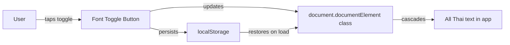
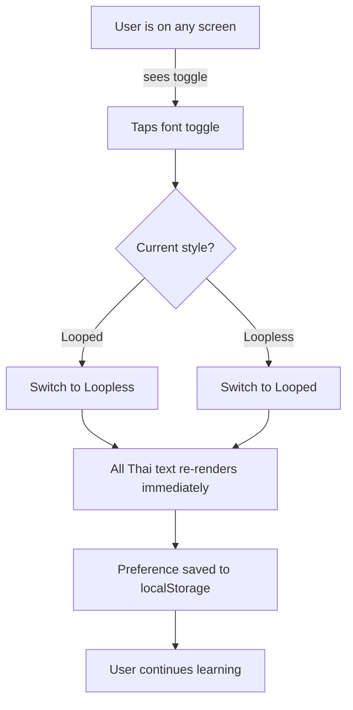
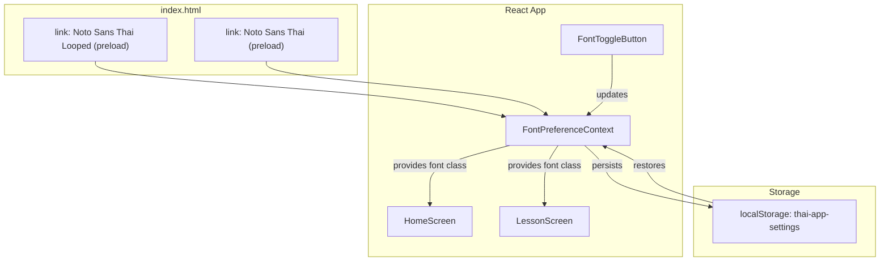

# Traditional vs Simplified Thai Script Toggle

> **Date:** 2026-03-03
> **Status:** Draft
> **Author:** AI-assisted

## Overview

Thai script has two visual styles: **looped** (traditional, with circular hooks called หัว on stroke endpoints) and **loopless** (modern/simplified, with clean-cut strokes). Both use the same Unicode characters -- the difference is purely typographic, determined by the font. This planning document covers adding a toggle that lets users switch between the two styles across the app, so they learn to recognize Thai characters in both forms. The immediate hotfix (switching from Noto Sans Thai to Noto Sans Thai Looped) restores traditional rendering as the default; this feature builds on that by making the choice user-controlled.

---

## Problem & Context

### Problem Statement

Learners who study Thai exclusively in one font style are unprepared when they encounter the other in real life. Traditional looped Thai dominates textbooks, street signs, menus, and government documents. Loopless Thai dominates digital interfaces (apps, websites, social media). A learner who only knows one style may struggle to read the other -- characters like ก, จ, ด, ข, ค, and ง look noticeably different between the two styles.

### Current Situation

- The app currently loads a single Google Font: **Noto Sans Thai Looped** (traditional, with loops)
- The font is set globally on `<body>` via `font-family: 'Noto Sans Thai Looped', sans-serif` in `src/index.css`
- There is no mechanism to switch fonts at runtime
- Users who encounter loopless Thai in the real world (apps, digital signage, social media) after learning only looped Thai may not recognize some characters

### Goals

- Allow users to toggle between traditional (looped) and modern (loopless) Thai rendering
- Default to traditional (looped) since it is the standard for Thai literacy education
- Persist the user's font preference across sessions
- Eventually introduce educational content that explicitly teaches the difference between the two styles

### Non-Goals

- Supporting arbitrary Thai fonts beyond the two Noto Sans Thai variants
- Per-character or per-word font mixing within a single view
- Serif Thai fonts (e.g., Noto Serif Thai) -- this is a future consideration
- Changing the romanization or transliteration based on font style (they are identical)

---

## Proposed Solution

### Direction

Load both Google Fonts (Noto Sans Thai and Noto Sans Thai Looped) upfront. Add a small toggle button to the app header/settings that switches between them. The toggle updates a CSS custom property or a class on the root element, which cascades to all Thai text. The user's choice is persisted in localStorage alongside existing app state.



### Alternatives Considered

1. **Per-lesson toggle**: Let users switch font per lesson rather than globally. Rejected because it adds complexity without clear benefit -- the toggle is about personal preference and real-world readiness, not lesson-specific pedagogy.

2. **Side-by-side rendering**: Show both styles simultaneously on every info card. Rejected for v1 because it clutters the UI and doubles the visual density. Better suited as a dedicated comparison exercise (see deferred scope).

3. **Settings page**: Put the toggle on a dedicated settings screen. Rejected for v1 because the app currently has no settings page, and adding one just for a single toggle is over-engineered. A small button in the header or on the home screen is sufficient. A settings page can come later when there are more settings to manage.

---

## Requirements

### User Workflows

#### Primary Workflow: Switching Font Style



#### Secondary Workflow: First-Time User

1. App loads with default font style: **Looped (traditional)**
2. User encounters the toggle (home screen or lesson header)
3. Optional: a one-time tooltip explains the two styles
4. User can ignore the toggle and continue with the default

### Functional Requirements

1. Both fonts (Noto Sans Thai and Noto Sans Thai Looped) must be loaded in `index.html`
2. A toggle button must be visible on the home screen and during lessons
3. Tapping the toggle must instantly switch all Thai text between looped and loopless rendering
4. The selected font style must persist in localStorage and be restored on app reload
5. The default font style for new users must be "looped" (traditional)
6. The toggle must not cause layout shifts or content jumps when switching
7. The toggle must work on all screen sizes (mobile, tablet, desktop)
8. Non-Thai text (English, romanization) must not be affected by the toggle

### Non-Functional Requirements

- Font switching must feel instant (< 100ms visual update)
- Both fonts must be preloaded to avoid flash of unstyled text on toggle
- Total additional payload for the second font: ~50-80KB (acceptable for a web font)

---

## Technical Design

### Architecture



### Key Components

#### 1. Font Loading (`index.html`)

Load both fonts. Use `display=swap` on both to ensure text is always visible. Use `<link rel="preload">` for the non-default font to avoid latency on first toggle.

```html
<!-- Primary (default) -->
<link href="https://fonts.googleapis.com/css2?family=Noto+Sans+Thai+Looped:wght@400;500;700&display=swap" rel="stylesheet" />
<!-- Secondary (loaded for toggle) -->
<link href="https://fonts.googleapis.com/css2?family=Noto+Sans+Thai:wght@400;500;700&display=swap" rel="stylesheet" />
```

#### 2. CSS Strategy (`src/index.css`)

Use a class on the root element to control which font family applies:

```css
body {
  font-family: 'Noto Sans Thai Looped', sans-serif;
}

body.font-loopless {
  font-family: 'Noto Sans Thai', sans-serif;
}
```

This approach is simple and cascades to all elements without needing per-component changes.

#### 3. Font Preference Context (`src/contexts/FontPreferenceContext.tsx`)

A React context that:
- Reads the saved preference from localStorage on mount
- Provides the current font style (`'looped' | 'loopless'`) and a toggle function
- Applies/removes the `font-loopless` class on `document.body`
- Saves the preference to localStorage on change

```typescript
type FontStyle = 'looped' | 'loopless'

interface FontPreferenceContextValue {
  fontStyle: FontStyle
  toggleFontStyle: () => void
}
```

#### 4. Font Toggle Button (`src/components/FontToggleButton.tsx`)

A small, unobtrusive button that shows the current style and switches on tap. Design options:

- **Icon-based**: A small "Aa" or Thai character icon that visually changes between looped/loopless
- **Text label**: "Traditional" / "Modern" toggle chip
- **Position**: Top-right corner of the home screen header; accessible but not distracting

The button should be compact (not a full toggle switch) to avoid cluttering the learning UI.

#### 5. Settings Persistence

Store font preference separately from the main app state to avoid triggering a state version migration. Use a dedicated localStorage key:

```typescript
const FONT_PREF_KEY = 'thai-app-font-style'
// Value: 'looped' | 'loopless'
```

### Data Design

No changes to lesson content types or data structures. The font style is purely a rendering concern. The `RichLesson`, `LessonStep`, and all exercise types remain unchanged.

Settings storage:
```json
// localStorage key: "thai-app-font-style"
// Value: "looped" (default) or "loopless"
```

### Implementation Plan

| Step | Description | Validates |
|------|-------------|-----------|
| 1 | Add second Google Font link to `index.html` | Both fonts load without errors; Network tab shows both font files |
| 2 | Add CSS class rule for `.font-loopless` in `src/index.css` | Adding class to body manually in DevTools switches all Thai text |
| 3 | Create `FontPreferenceContext` with localStorage persistence | Context provides correct font style; survives page reload |
| 4 | Wrap app in `FontPreferenceProvider` in `App.tsx` | Context is available throughout the component tree |
| 5 | Create `FontToggleButton` component | Button renders, shows current style, calls toggle on click |
| 6 | Add toggle button to `HomeScreen` header | Visible on home screen, toggles font globally |
| 7 | Add toggle button to lesson header (optional, accessible location) | Toggle works during lessons too |
| 8 | Add E2E test: toggle switches font family | Playwright verifies computed font-family changes on toggle |
| 9 | Add E2E test: preference persists across reload | Toggle, reload, verify preference restored |

---

## Success Criteria

- [ ] Both font styles render all 44 Thai consonants and all vowel combinations correctly
- [ ] Toggle switches all Thai text instantly with no visible layout shift
- [ ] Default for new users is traditional (looped)
- [ ] Preference survives page reload and browser restart
- [ ] Toggle is discoverable but not distracting on mobile (320px) and desktop (1440px)
- [ ] No regression in existing E2E tests (font change should not affect test selectors)

---

## Open Questions

1. **Toggle placement during lessons**: Should the toggle appear in the lesson header bar (next to "Exit"), or only on the home screen? Showing it during lessons lets users experiment, but could be distracting. Recommend: show on home screen only for v1, add to lesson header in v2 if users request it.

2. **One-time educational tooltip**: Should we show a brief explanation of looped vs loopless the first time a user sees the toggle? Recommend: yes, a single dismissible tooltip that says "Thai has two writing styles: traditional (with loops) and modern (without). You can switch anytime."

3. **Comparison exercises (future)**: A dedicated lesson or exercise type that shows both styles side by side and asks users to match them. This would be a separate feature built on top of the font toggle infrastructure. Not in scope for this plan, but the toggle architecture supports it.

---

## Appendix

### Visual Comparison of Key Characters

Characters with the most visible differences between looped and loopless:

| Character | Name | Looped | Loopless | Difference |
|-----------|------|--------|----------|------------|
| ก | gor gai | Loop at top-left hook | Straight cut | Small but visible |
| จ | jor jaan | Circular loop at bottom | Smooth curve | Very visible |
| ด | dor dek | Loop at top | Sharp angle | Very visible |
| ข | khor khai | Loop at top | Straight line | Visible |
| ค | kor kwai | Loop at top | Clean line | Visible |
| ง | ngor ngoo | Loop at top | Smooth stroke | Moderate |
| ฉ | chor ching | Loop at top | Straight | Visible |
| ถ | thor thung | Loop at top | Straight | Visible |

### Research Reference

Research on Thai font loops ([Typotheque: The Contemporary Effects of Thai Loops](https://www.typotheque.com/research/effects-of-loops-in-thai)) shows:
- Looped text is read significantly faster in paragraph reading
- Older readers prefer looped; younger readers are more efficient with loopless
- Looped is associated with "classical" and "formal"; loopless with "modern" and "unusual"
- For a learning app, defaulting to looped is the correct pedagogical choice

### Google Fonts Used

- **Noto Sans Thai Looped**: [fonts.google.com/noto/specimen/Noto+Sans+Thai+Looped](https://fonts.google.com/noto/specimen/Noto+Sans+Thai+Looped) -- Traditional style with loops. Weights: 100-900.
- **Noto Sans Thai**: [fonts.google.com/specimen/Noto+Sans+Thai](https://fonts.google.com/specimen/Noto+Sans+Thai) -- Modern loopless style. Weights: 100-900.
