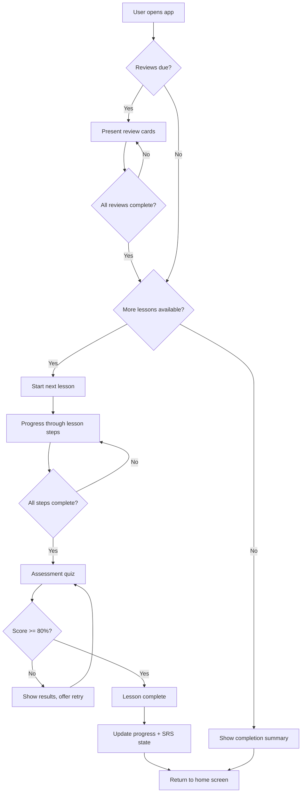
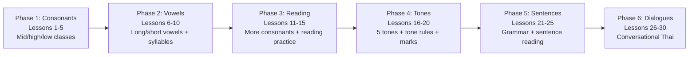
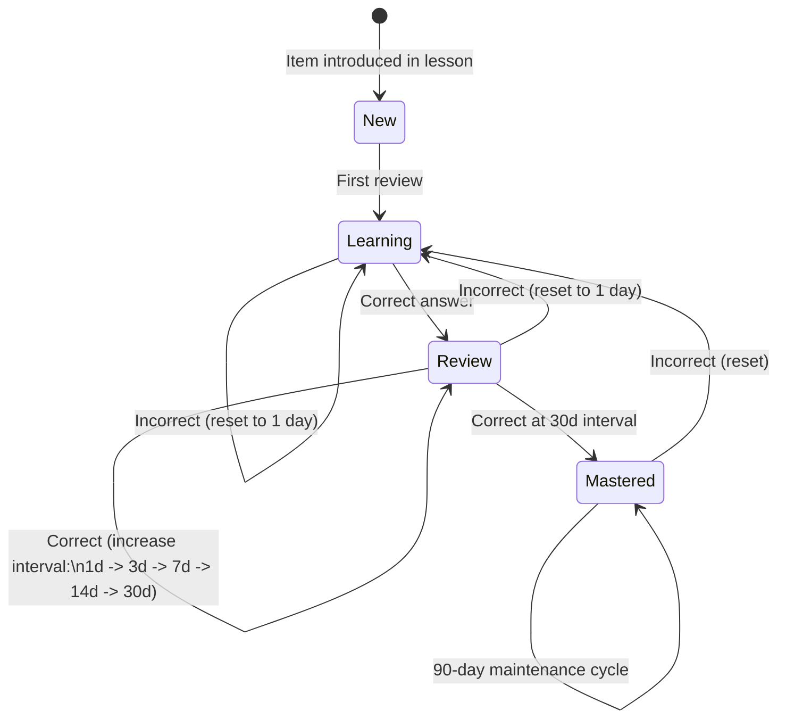
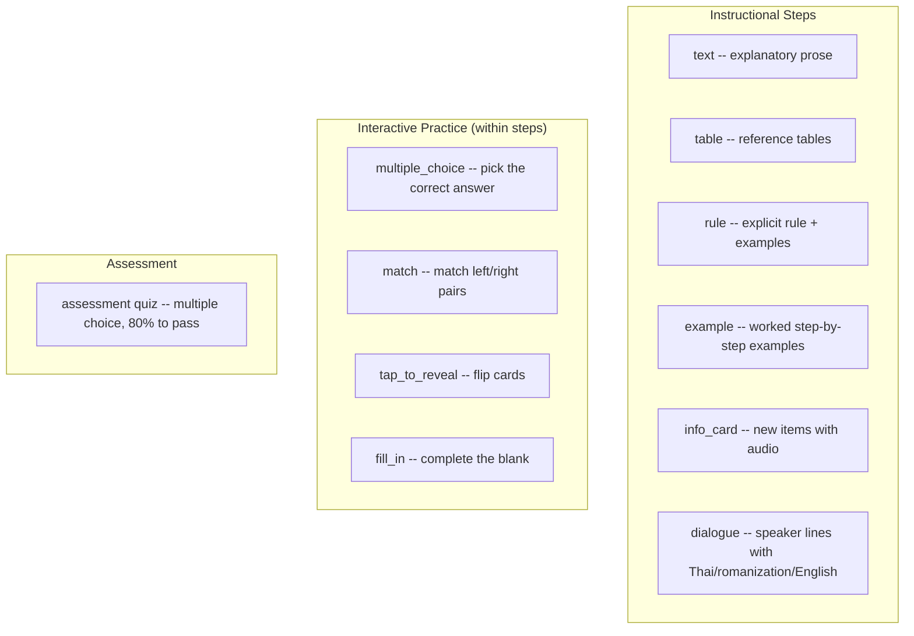

# PRD: Thai Reading-First Learning App

## Overview

A minimalistic, responsive web app that teaches Thai through a reading-first approach. Unlike conventional Thai language apps that rely on romanization (e.g., "sawadee krap"), this app puts Thai script front and center from lesson one. Users first learn to decode glyphs, syllables, and words directly, then progress through tone rules, sentence construction, and conversational Thai -- all grounded in the ability to read the script.

The app uses **30 rich, step-based lessons** organized into 6 phases. Each lesson is a curated sequence of instructional steps (text explanations, tables, rules, examples, interactive practice, dialogues, and info cards) followed by an assessment quiz. This replaces the earlier auto-generated flat lesson model (117 lessons of 3 items each) with hand-crafted pedagogical content that teaches concepts explicitly rather than relying solely on flashcard drilling.

The app uses the **Paiboon+ romanization system** with diacritical tone marks (mid tone = unmarked, low tone = grave accent, falling tone = circumflex, high tone = acute accent, rising tone = caron). Tone rules are taught explicitly in a dedicated phase rather than through implicit exposure alone. All content is delivered through rich step types and interactive practice exercises with audio support via the browser's Web Speech API.

## Goals

- **Teach Thai script reading from lesson one.** No romanization crutch. Users see Thai glyphs and learn to decode them. Paiboon+ romanization is used as a learning aid, not a primary representation.
- **Cover the full Thai consonant set (44 consonants) and the most common vowels (~18 vowel forms) in a structured, linear progression** across 30 rich step-based lessons.
- **Build reading ability progressively** through curated lessons that combine instructional text, reference tables, explicit rules, worked examples, interactive practice, and dialogues.
- **Teach tone rules explicitly** through a dedicated Tones phase (lessons 16-20) that covers the 5 Thai tones, consonant class interactions, live/dead syllables, and all 4 tone marks. Uses Paiboon+ diacritical marks to indicate tones in romanization.
- **Teach grammar and sentence construction through reading.** Users learn Thai grammar patterns (SVO order, negation, questions, tense markers, adjectives) by reading and understanding sentences in Thai script in the Sentences phase (lessons 21-25).
- **Build conversational competence grounded in literacy.** Common conversational phrases and dialogues (greetings, restaurant, directions, shopping) are introduced in the Dialogues phase (lessons 26-30).
- **Use spaced repetition** to ensure long-term retention of characters, syllables, vocabulary, grammar patterns, and phrases.

## Non-Goals

- **Not a gamified experience.** No XP, streaks, leaderboards, avatars, or badges. Progress is shown simply and honestly.
- **Not a romanization tool.** Romanization (e.g., IPA or Royal Thai transliteration) may appear as answer options or hints, but never as the primary representation of Thai.
- **Not a writing app.** Users are not asked to draw or type Thai characters. Input is always selection-based (multiple choice).
- **Not offline-first in v1.** The app will work in modern browsers but does not need to function offline or be installable as a PWA.

## User Workflows

### Primary Workflow: Daily Learning Session

1. User opens the app in their browser (desktop or mobile).
2. **If there are due review cards:** The app presents review flashcards first. The user can complete reviews before accessing new material. Reviews use spaced repetition intervals (cards appear at increasing intervals as the user demonstrates mastery).
3. **After reviews are complete (or if none are due):** The app presents the next available lesson. The home screen shows the lesson title and goal as a preview.
4. **Lesson flow (rich step-based):**
   a. **Instructional steps:** The user progresses through a curated sequence of steps. Each step may be a text explanation, a reference table, an explicit rule with examples, a worked example with labeled sub-steps, info cards presenting new items with audio, interactive practice exercises, or a dialogue with speaker lines. The user advances through steps by tapping "Continue."
   b. **Practice exercises (within steps):** Interspersed throughout the lesson, practice exercises test comprehension using multiple choice, match pairs (drag left items to right items), tap-to-reveal flashcards, and fill-in-the-blank sentences.
   c. **Assessment quiz:** After all steps are complete, the lesson presents an assessment quiz of multiple-choice questions. The user must score at least 80% to pass and unlock the next lesson. On failure, the user can retry the assessment immediately.
5. After completing a lesson, the user sees a result screen showing their score. If passed, their progress is updated and associated SRS items enter the spaced repetition system. The user returns to the home screen.

### Secondary Workflow: Review-Only Session

1. User opens the app.
2. Due review cards are presented.
3. The user completes reviews without starting a new lesson.
4. The app shows a summary: cards reviewed, accuracy, next review time.

### Secondary Workflow: Reading Practice (Phase 3: Lessons 11-15)

1. After the user has learned consonants and vowels, the Reading phase introduces more consonants (high-class, low-class) integrated with reading practice.
2. Lessons combine new consonant introduction with syllable-building exercises, so the user practices decoding real syllables composed of learned characters.
3. Practice exercises test genuine reading ability through multiple exercise types.

### Secondary Workflow: Tone Learning (Phase 4: Lessons 16-20)

1. The Tones phase explicitly teaches the 5 Thai tones, live/dead syllable distinction, tone rules for each consonant class, and the 4 tone marks.
2. Tone rules are presented through explicit rule steps and reinforced with practice exercises. The Paiboon+ romanization system uses diacritical marks to indicate tones.
3. This replaces the earlier approach of implicit-only tone learning with explicit instruction.

### Secondary Workflow: Sentence Reading (Phase 5: Lessons 21-25)

1. After learning tones, the Sentences phase teaches Thai grammar through reading full sentences.
2. Topics include SVO word order, negation with mai, question particles, tense markers, and adjective placement.
3. Each lesson uses text explanations, rule steps, and worked examples followed by practice exercises and an assessment.

### Secondary Workflow: Conversational Dialogues (Phase 6: Lessons 26-30)

1. The Dialogues phase introduces common conversational situations: greetings, restaurant ordering, asking directions, shopping, and a review dialogue.
2. Each lesson includes dialogue steps with speaker lines, Thai script, Paiboon+ romanization, and English translations.
3. Practice exercises test comprehension of the dialogues and associated vocabulary.

## User Journey Diagrams

### Daily Session Flow

### Learning Phase Progression

### Spaced Repetition Lifecycle

### Lesson Step Types

## Requirements

### Functional Requirements

**Learning Content**

1. The app must contain all 44 Thai consonants, introduced across the Consonants and Reading phases in a pedagogically sensible order (mid-class first, then high-class, then low-class) to support tone rule learning.
2. The app must contain the 18 most common Thai vowel forms (short and long variants of the core vowels), introduced in the Vowels phase with integrated syllable-building practice.
3. Tone rules must be taught explicitly in a dedicated Tones phase covering all 5 Thai tones, live/dead syllable distinction, tone mark effects, and consonant class interactions with tone marks.
4. Tone marks (mai ek, mai tho, mai tri, mai jattawa) must be introduced in the Tones phase with explicit rules and practice.
5. Each consonant must have its associated keyword (e.g., ก = ไก่/chicken) for mnemonic support, presented in info_card steps.
6a. The app must contain grammar coverage in the Sentences phase: SVO order, negation (ไม่), question particles (ไหม, หรือ), tense markers (จะ, แล้ว, กำลัง), and adjective placement. Grammar is taught through a combination of explicit rules and reading examples.
6b. The app must contain conversational dialogues in the Dialogues phase covering: greetings and polite particles, restaurant situations, asking directions, shopping, and review conversations. Dialogues are presented with speaker lines in Thai script, Paiboon+ romanization, and English translation.
6c. All romanization uses the Paiboon+ system with tone marks: mid tone = unmarked, low tone = grave accent, falling tone = circumflex, high tone = acute accent, rising tone = caron.

**Lesson System**

6. Lessons must follow a strict linear progression. The user cannot skip ahead. Each lesson declares its prerequisites (prior lesson IDs).
7. The app has 30 rich step-based lessons organized into 6 phases of 5 lessons each: Consonants (1-5), Vowels (6-10), Reading (11-15), Tones (16-20), Sentences (21-25), Dialogues (26-30).
8. Each lesson consists of a sequence of instructional steps followed by an assessment quiz.
9. Lesson steps include 7 types: text (explanatory prose), table (reference data), rule (explicit rule with examples), example (worked step-by-step), practice (interactive exercises), dialogue (speaker lines), and info_card (new items with audio).
10. Practice exercises within steps include 4 types: multiple choice, match pairs, tap-to-reveal flashcards, and fill-in-the-blank.
11. Each lesson ends with an assessment quiz of multiple-choice questions.
12. The user must score at least 80% on the assessment to unlock the next lesson. On failure, the assessment is immediately retryable (the instructional steps do not need to be repeated).

**Practice and Assessment Exercise Types**

13. Multiple choice: A prompt (optionally with Thai text displayed large) and 4 options. The user selects one.
14. Match pairs: A set of left-right pairs (e.g., Thai character to romanization). The user matches them.
15. Tap-to-reveal: Cards with a front (Thai text) and back (romanization/meaning). The user taps to flip.
16. Fill-in-the-blank: A sentence with a blank (___). The user selects the correct word from options.
17. Assessment questions: Multiple-choice format, used in the end-of-lesson quiz. Scored to determine pass/fail.

**Spaced Repetition System**

17. The SRS must track each item independently with the following states: new, learning, review, mastered.
18. Review intervals must increase with each successful recall: 1 day, 3 days, 7 days, 14 days, 30 days. After 30 days, the item is marked "mastered" and enters a 90-day maintenance cycle.
19. A failed review resets the item to the "learning" state with a 1-day interval.
20. Due reviews must be presented before new lessons are available in any session.
21. SRS state must persist across sessions using browser local storage.

**Audio**

22. The app must play audio pronunciation for every Thai character, syllable, and word.
23. Audio must use the Web Speech API with a Thai language voice.
24. Audio must play automatically when a new item is introduced and on demand when the user taps/clicks the Thai text on any card.
25. If no Thai voice is available in the browser, the app must display a visible notice and continue to function without audio.

**Progress and State**

26. The app must persist all user progress (lesson completion, SRS state, quiz scores) in browser local storage.
27. The home screen must show: current lesson number, total lessons (30), number of items mastered, and number of reviews due.
28. The app must display a simple progress indicator showing the user's position in the overall learning map (e.g., "Lesson 5 of 30" or a progress bar). The home screen should also show which phase the user is in (Consonants, Vowels, Reading, Tones, Sentences, Dialogues) and a preview of the next lesson's title and goal.

**User Interface**

29. The interface must be responsive and usable on screens from 320px (mobile) to 1440px+ (desktop).
30. Flashcards must display Thai text at a large, readable size (minimum 48px on mobile, 64px on desktop).
31. The app must use a clean, minimal design: white or off-white background, dark text, no decorative elements.
32. Navigation must be simple: home screen, lesson/review screen. No deep menus, settings pages, or onboarding flows in v1.
33. Multiple-choice options must be large enough to tap comfortably on mobile (minimum 44px touch target per Apple HIG).
34. After answering a card, the app must show immediate feedback: correct (green highlight) or incorrect (red highlight with the correct answer shown).
35. Transitions between cards should be smooth but fast. No animations longer than 200ms.

### Non-Functional Requirements

36. The app must load in under 3 seconds on a 3G connection (initial load). Subsequent interactions must feel instant (<100ms response).
37. All learning content (characters, words, lesson structure) must be bundled with the app, not fetched from an API. The app has no backend.
38. The app must work in the latest versions of Chrome, Firefox, Safari, and Edge.
39. Local storage usage must stay under 5MB.

## Decisions Made

| Decision | Choice | Reasoning |
|---|---|---|
| Lesson format | 30 rich step-based lessons | Replaces 117 auto-generated flat lessons. Hand-crafted lessons with diverse step types (text, table, rule, example, practice, dialogue, info_card) provide better pedagogy than repetitive flashcard drilling. Each lesson is a self-contained teaching unit. |
| Phase organization | 6 phases of 5 lessons each | Consonants (1-5), Vowels (6-10), Reading (11-15), Tones (16-20), Sentences (21-25), Dialogues (26-30). Clean, predictable structure. Each phase has a clear pedagogical focus. |
| Tone rule teaching | Explicit (dedicated phase) | Changed from implicit-only to explicit instruction. A dedicated Tones phase (lessons 16-20) teaches tone rules directly through rule steps, tables, and practice exercises. Explicit rules are reinforced with practice rather than relying solely on pattern absorption. |
| Romanization system | Paiboon+ with diacritical tone marks | Mid tone = unmarked, low = grave accent, falling = circumflex, high = acute accent, rising = caron. Widely used, well-documented system that encodes tone information directly in the romanization. |
| Practice exercise types | 4 types: multiple choice, match pairs, tap-to-reveal, fill-in-the-blank | Richer than the original 4-option multiple choice only. Match pairs tests association, tap-to-reveal supports self-paced review, fill-in-the-blank tests productive recall. |
| Assessment format | End-of-lesson multiple-choice quiz, 80% to pass | Retains the 80% pass threshold from the original design. Assessment is separate from instructional steps -- on retry, the user repeats only the quiz, not the full lesson. |
| Audio source | Web Speech API (browser TTS) | Free, automatic coverage of all content, no hosting costs. Quality varies by device but is acceptable for pronunciation reference. Can be upgraded to pre-recorded audio later. |
| Platform | Responsive web app | Easiest to build, deploy, and share. Works on all devices. No app store friction. |
| Session flow | Reviews available alongside lessons | Reviews are presented prominently on the home screen but do not strictly block new lessons. Both buttons are available when reviews are due. |
| Learning path | Strictly linear with prerequisites | Each lesson declares prerequisite lesson IDs. The user cannot skip ahead. |
| Data persistence | Browser local storage (version 2) | Storage version bumped from 1 to 2 to support the new 30-lesson structure. Migration logic maps old v1 progress (117 lessons) to v2 proportionally. Old lesson results are cleared since lesson IDs changed. |
| Gamification | None | The target user wants to learn to read Thai, not collect badges. A minimal interface respects the user's time and attention. Progress display is informational only. |
| Grammar teaching | Mixed explicit and inductive | The Sentences phase uses both explicit rule steps and reading-based examples. Rules are stated clearly, then reinforced through practice exercises that require reading Thai sentences. |
| Conversation scope | 5 dialogue lessons in practical contexts | Greetings, restaurant, directions, shopping, and a review dialogue. Each lesson uses dialogue steps with Thai/romanization/English for each speaker line. |

## Out of Scope (v1)

- **User accounts and cloud sync.** Progress is local only. Multi-device sync is a v2 feature.
- **Writing practice.** No tracing, drawing, or typing Thai characters. Reading only.
- **Speech recognition / speaking practice.** The app does not evaluate pronunciation. Audio is output-only (TTS playback).
- **Free-form text input.** All answers are multiple choice. No typing Thai.
- **Custom lesson ordering or skip-ahead.** The path is linear and locked.
- **Detailed statistics and analytics.** No charts, no per-character accuracy breakdowns. Just the summary on the home screen.
- **Offline/PWA support.** Requires a browser with internet for initial load. (Since all content is bundled, it effectively works offline after loading, but no explicit service worker or PWA manifest in v1.)
- **Accessibility beyond responsive design.** Screen reader support, high-contrast mode, and other a11y features are important but deferred to v2.
- **Advanced grammar.** Complex structures (relative clauses, passive voice, formal registers) are deferred. V1 covers essential conversational grammar only.

## Success Criteria

1. **A new user can open the app and complete their first lesson in under 10 minutes** without any instructions or onboarding beyond what the lesson steps themselves provide. The rich step format guides the user through explanations, examples, and practice.
2. **After completing the Consonants phase (lessons 1-5), a user understands consonant classes** (mid, high, low) and can identify the sounds of the consonants covered, with at least 80% accuracy in a review session.
3. **After completing the Reading phase (lessons 11-15), the user can read simple Thai syllables** composed of learned consonants and vowels and select the correct pronunciation.
4. **After completing the Tones phase (lessons 16-20), a user understands the 5 Thai tones, can identify tone marks, and can apply basic tone rules** to determine the tone of a given syllable.
5. **After completing the Sentences phase (lessons 21-25), a user can read simple Thai sentences and understand their meaning.** They can identify SVO order, negation, and question patterns.
6. **After completing the Dialogues phase (lessons 26-30), a user can read and understand common Thai conversational exchanges** in practical contexts (greetings, ordering food, asking for directions, shopping).
7. **A user who completes all 30 lessons and maintains their reviews can read simple Thai text** (signs, menus, labels, short messages) and understand both the pronunciation and the meaning.
8. **The spaced repetition system keeps mastered items in long-term memory.** A user who returns after a 2-week break finds their due reviews manageable (not hundreds of cards) and can still recall previously mastered items at >70% accuracy.
