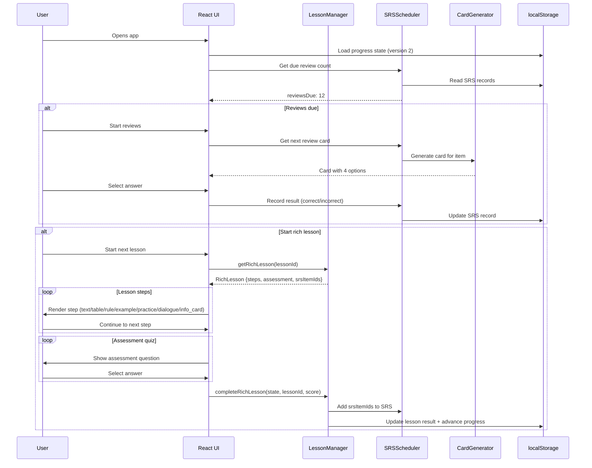
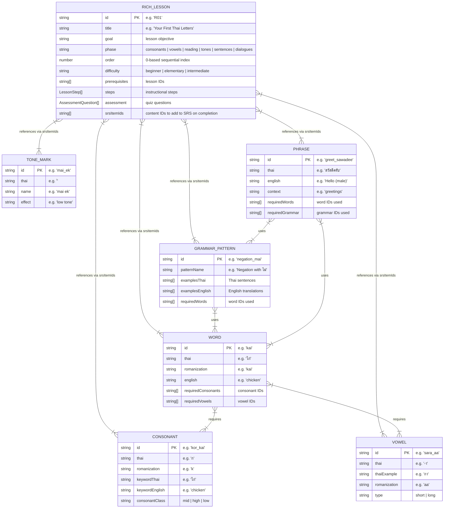
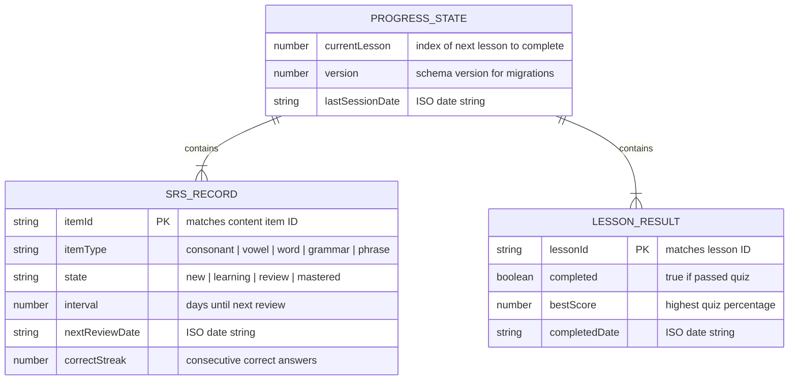
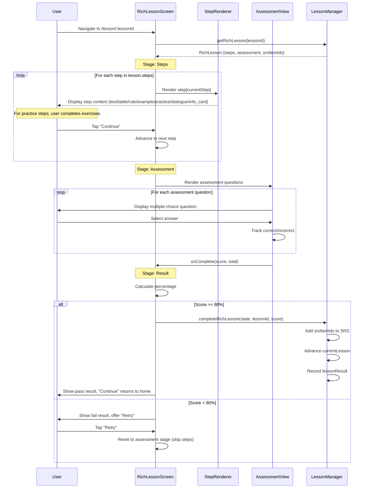
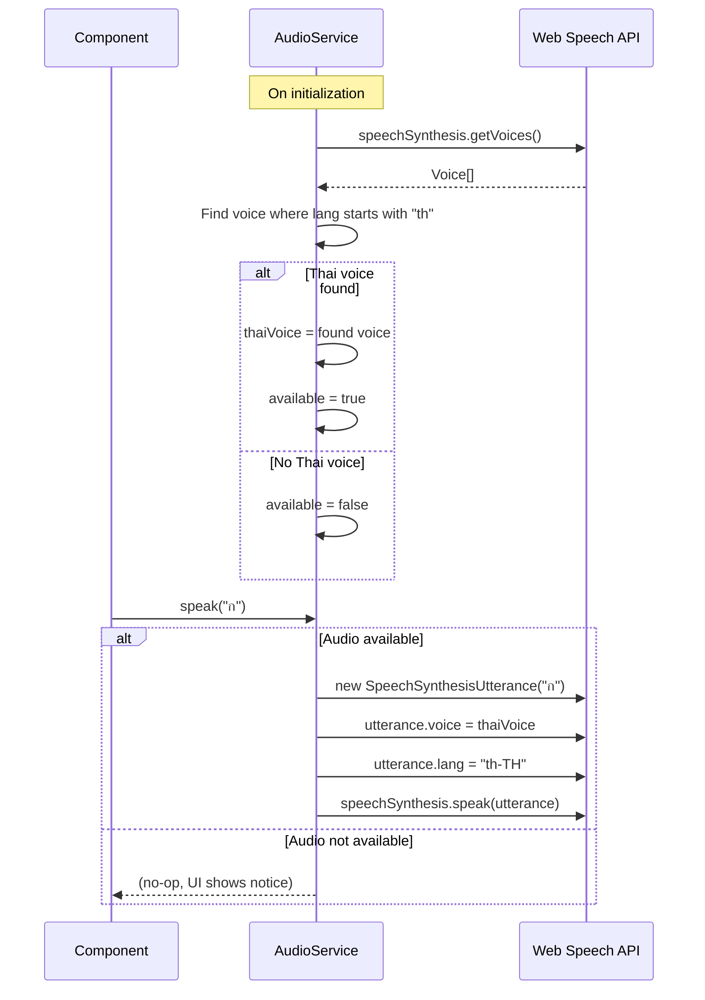

# Tech Spec: Thai Reading-First Learning App

## Overview

This spec defines how to build the Thai Reading-First Learning App described in [`docs/prd.md`](./prd.md). It covers architecture, data design, component breakdown, and an ordered implementation plan. The app is a client-side React + TypeScript SPA with no backend -- all content is bundled at build time and all state lives in browser localStorage.

The app uses a **rich step-based lesson system** with 30 hand-crafted lessons organized into 6 phases. Each lesson contains a sequence of typed instructional steps (text, table, rule, example, practice, dialogue, info_card) followed by a multiple-choice assessment quiz. This replaces the earlier auto-generated flat lesson model.

## Architecture

### System Overview

The app is a single-page application with three layers:

1. **Content layer** -- static JSON data files containing all Thai learning content (consonants, vowels, words, grammar patterns, phrases, lesson definitions). Bundled at build time.
2. **Engine layer** -- TypeScript modules that implement the lesson system, SRS scheduler, card generation, and distractor selection. Pure logic, no UI.
3. **UI layer** -- React components that render the home screen, lesson flow, and review sessions. Thin presentation layer that delegates to the engine.

```mermaid
flowchart TD
    subgraph "UI Layer (React)"
        Home[HomeScreen]
        RichLesson[RichLessonScreen]
        Review[ReviewScreen]
        StepR[StepRenderer]
        Assessment[AssessmentView]
        Result[LessonResultView]
    end
    subgraph "Step Views"
        TV[TextStepView]
        TBV[TableStepView]
        RV[RuleStepView]
        EV[ExampleStepView]
        PV[PracticeStepView]
        DV[DialogueStepView]
        ICV[InfoCardStepView]
    end
    subgraph "Exercise Views"
        MC[MultipleChoiceView]
        MV[MatchView]
        TR[TapToRevealView]
        FI[FillInView]
    end
    subgraph "Engine Layer (TypeScript)"
        LM[LessonManager]
        SRS[SRSScheduler]
        CG[CardGenerator]
        Audio[AudioService]
        Store[Storage v2]
    end
    subgraph "Content Layer"
        CC[consonants.ts]
        CV[vowels.ts]
        CW[words.ts]
        CGR[grammar.ts]
        CP[phrases.ts]
        CTM[tonemarks.ts]
        RL[richLessons/]
    end
    subgraph "Persistence (localStorage)"
        LS[(localStorage v2)]
    end

    Home --> LM
    Home --> SRS
    RichLesson --> LM
    RichLesson --> StepR
    RichLesson --> Assessment
    RichLesson --> Result
    StepR --> TV
    StepR --> TBV
    StepR --> RV
    StepR --> EV
    StepR --> PV
    StepR --> DV
    StepR --> ICV
    PV --> MC
    PV --> MV
    PV --> TR
    PV --> FI
    Review --> SRS
    Review --> CG
    Review --> Audio
    LM --> RL
    CG --> CC
    CG --> CV
    CG --> CW
    CG --> CGR
    CG --> CP
    CG --> CTM
    SRS --> LS
    Store --> LS
    LM --> Store
```



### Data Flow



### Project Structure

```
thai-learning-app/
  docs/
    prd.md
    spec.md
    tickets.md
  public/
  src/
    main.tsx                  # Entry point
    App.tsx                   # Router setup (uses RichLessonScreen)
    content/                  # Static content data
      consonants.ts           # 44 consonants with metadata
      vowels.ts               # 18 vowel forms
      tonemarks.ts            # 4 tone marks
      words.ts                # ~200 vocabulary words
      grammar.ts              # ~30 grammar patterns with examples
      phrases.ts              # ~50 conversational phrases
      lessons.ts              # Legacy flat lesson sequence (kept but unused by router)
      lessonTypes.ts          # Rich lesson type definitions (steps, exercises, assessment)
      types.ts                # Content type definitions
      richLessons/            # 30 rich step-based lessons
        index.ts              # Aggregates all 6 phase files
        phase1.ts             # Consonants (lessons R01-R05)
        phase2.ts             # Vowels (lessons R06-R10)
        phase3.ts             # Reading (lessons R11-R15)
        phase4.ts             # Tones (lessons R16-R20)
        phase5.ts             # Sentences (lessons R21-R25)
        phase6.ts             # Dialogues (lessons R26-R30)
    engine/                   # Core logic (no React dependency)
      lessonManager.ts        # Lesson progression logic (supports both legacy and rich lessons)
      srsScheduler.ts         # Spaced repetition scheduling
      cardGenerator.ts        # Card + distractor generation (for SRS reviews)
      audioService.ts         # Web Speech API wrapper
      storage.ts              # localStorage read/write (version 2 with v1 migration)
      types.ts                # Engine type definitions (AppState version 1|2)
    components/               # React components
      HomeScreen.tsx          # Dashboard showing progress, phase, next lesson preview
      LessonScreen.tsx        # Legacy lesson screen (kept but unused by router)
      ReviewScreen.tsx        # SRS review session
      FlashCard.tsx           # Card display + answer selection (used by ReviewScreen)
      ProgressBar.tsx         # Simple progress indicator
      AudioButton.tsx         # Tap-to-hear button
      FeedbackOverlay.tsx     # Correct/incorrect feedback
      lesson/                 # Rich lesson components
        RichLessonScreen.tsx  # Main lesson screen (steps -> assessment -> result)
        StepRenderer.tsx      # Dispatches to correct step view by kind
        StepProgressBar.tsx   # Visual progress through lesson steps
        AssessmentView.tsx    # End-of-lesson quiz (80% to pass)
        LessonResultView.tsx  # Pass/fail result with retry option
        steps/                # Step type renderers
          TextStepView.tsx    # Renders text steps (supports **bold** and *italic*)
          TableStepView.tsx   # Renders table steps with headers and rows
          RuleStepView.tsx    # Renders rule + examples
          ExampleStepView.tsx # Renders worked examples with labeled steps
          PracticeStepView.tsx # Dispatches to exercise views
          DialogueStepView.tsx # Renders dialogue with speaker lines
          InfoCardStepView.tsx # Renders info cards with audio
        exercises/            # Practice exercise renderers
          MultipleChoiceView.tsx # Multiple-choice exercise
          MatchView.tsx       # Match-pairs exercise
          TapToRevealView.tsx # Tap-to-reveal flashcard exercise
          FillInView.tsx      # Fill-in-the-blank exercise
    hooks/                    # Custom React hooks
      useProgress.ts          # Progress state from localStorage
      useAudio.ts             # Audio playback hook
    index.css                 # Tailwind imports + global styles
  tsconfig.json
  tsconfig.app.json
  tsconfig.node.json
  vite.config.ts
  vitest.config.ts
  eslint.config.js
  package.json
```

### Key Components

**Content modules** (`src/content/`)
- Pure data exports. No logic, no side effects.
- Each module exports a typed array/map of items.
- `richLessons/` contains 30 rich lessons split across 6 phase files. Each lesson has an ID (R01-R30), title, goal, phase, prerequisites, steps array, assessment array, and srsItemIds array.
- `lessonTypes.ts` defines the type system for rich lessons: step kinds (text, table, rule, example, practice, dialogue, info_card), exercise types (multiple_choice, match, tap_to_reveal, fill_in), assessment questions, and the RichLesson interface.
- `lessons.ts` contains the legacy flat lesson definitions (kept for backward compatibility but not used by the router).

**LessonManager** (`src/engine/lessonManager.ts`)
- Supports both legacy flat lessons and rich lessons. The rich lesson API is used by the current router.
- `getRichLesson(id)` returns a single rich lesson by ID.
- `getCurrentRichLesson(state)` returns the next uncompleted rich lesson.
- `getCurrentRichPhase(state)` returns the current phase name.
- `completeRichLesson(state, lessonId, score)` validates the score (>=80%), adds SRS items, updates lesson results, and advances progress. Returns a new AppState.
- Initialized on app load via `initLessonManager()` with all content and rich lessons.

**SRSScheduler** (`src/engine/srsScheduler.ts`)
- Manages the SRS state for every item the user has encountered.
- Calculates which items are due for review based on current time.
- Updates intervals on correct/incorrect answers.
- Reads/writes SRS records to localStorage via `storage.ts`.

**CardGenerator** (`src/engine/cardGenerator.ts`)
- Used by the ReviewScreen for SRS review sessions.
- Given an item and the user's learned item pool, generates a flashcard with 3 plausible distractors.
- Not used by the rich lesson flow, which defines its own exercises and assessment questions inline.

**AudioService** (`src/engine/audioService.ts`)
- Wraps the Web Speech API.
- Detects Thai voice availability on initialization.
- Exposes `speak(text: string): void` and `isAvailable(): boolean`.

**Storage** (`src/engine/storage.ts`)
- Thin wrapper around localStorage with typed get/set.
- Current version: 2 (bumped from 1 to support the 30-lesson structure).
- Handles serialization, versioning, and missing data gracefully.
- Includes migration logic from v1 to v2: maps old lesson progress proportionally (oldLesson/117 * 30), preserves SRS records, clears old lesson results (IDs changed).

**RichLessonScreen** (`src/components/lesson/RichLessonScreen.tsx`)
- Main lesson UI component, routed at `/lesson/:lessonId`.
- Manages three stages: steps, assessment, result.
- During the steps stage, renders each lesson step via StepRenderer with a "Continue" button.
- After all steps, transitions to AssessmentView for the quiz.
- On quiz completion, shows LessonResultView with pass/fail and retry option.
- On pass (>=80%), calls `completeRichLesson()` to update state.

**StepRenderer** (`src/components/lesson/StepRenderer.tsx`)
- Dispatches to the correct step view component based on the step's `kind` field.
- Each step kind has its own view: TextStepView, TableStepView, RuleStepView, ExampleStepView, PracticeStepView, DialogueStepView, InfoCardStepView.

**Practice Exercise Views** (`src/components/lesson/exercises/`)
- MultipleChoiceView: prompt, optional large Thai text, 4 options, feedback.
- MatchView: left-right pair matching.
- TapToRevealView: flip cards with front/back and optional audio.
- FillInView: sentence with blank, select correct word from options.

## Data Design

### Content Data Structures



### Rich Lesson Step Type System

Each lesson's `steps` array contains objects with a `kind` discriminator:

| Step Kind | Fields | Purpose |
|-----------|--------|---------|
| `text` | content (string, supports **bold** and *italic*) | Explanatory prose |
| `table` | title?, headers[], rows[][] | Reference tables (e.g., consonant charts) |
| `rule` | rule (string), examples[{thai, romanization, english}] | Explicit rules with examples |
| `example` | title, steps[{label, content}] | Worked step-by-step examples |
| `practice` | exercises[] (see below) | Interactive exercises |
| `dialogue` | title, lines[{speaker, thai, romanization, english}] | Conversational dialogues |
| `info_card` | items[{thai, romanization, english, detail?, audioText?}] | New items with audio |

Practice exercises within a `practice` step use a `type` discriminator:

| Exercise Type | Fields | Purpose |
|---------------|--------|---------|
| `multiple_choice` | prompt, promptThai?, options[], correctIndex, audioText? | Pick the correct answer from 4 options |
| `match` | pairs[{left, right}] | Match left items to right items |
| `tap_to_reveal` | cards[{front, back, audioText?}] | Flip cards to reveal answer |
| `fill_in` | sentence (with ___), answer, options[] | Fill in the blank |

Assessment questions use the `multiple_choice` format with prompt, optional promptThai, options[], correctIndex, and optional audioText.

### User State (localStorage)



### localStorage Schema

All state is stored under a single key `thai-app-state` as a JSON object:

```typescript
interface AppState {
  version: 1 | 2;                 // Current version is 2
  currentLesson: number;          // Index into richLessons array (0-29)
  lastSessionDate: string;        // ISO 8601
  srsRecords: Record<string, SRSRecord>;
  lessonResults: Record<string, LessonResult>;  // Keyed by rich lesson ID (R01-R30)
}

interface SRSRecord {
  itemId: string;
  itemType: 'consonant' | 'vowel' | 'tonemark' | 'word' | 'grammar' | 'phrase';
  state: 'new' | 'learning' | 'review' | 'mastered';
  interval: number;               // days
  nextReviewDate: string;         // ISO 8601
  correctStreak: number;
}

interface LessonResult {
  lessonId: string;
  completed: boolean;
  bestScore: number;              // 0-100
  completedDate: string | null;   // ISO 8601
}
```

**Version migration (v1 to v2):** When the storage module loads v1 state, it applies the `migrateV1toV2` function:
- Maps old lesson progress proportionally: `newCurrentLesson = floor((oldCurrentLesson / 117) * 30)`.
- Preserves existing SRS records (item IDs are the same across versions).
- Clears old lesson results (lesson IDs changed from L01-L117 to R01-R30).
- Sets version to 2.

Estimated size: 30 lessons x ~100 bytes per lesson result + ~350 items x ~150 bytes per SRS record = ~55KB. Well under the 5MB limit (PRD #39).

## Detailed Design

### Lesson Phases and Counts

| Phase | Lessons | IDs | Focus | Step types typically used |
|-------|---------|-----|-------|--------------------------|
| 1: Consonants | 5 | R01-R05 | Mid-class, high-class, low-class consonants; consonant classes | info_card, rule, table, practice (MC, match, tap-to-reveal) |
| 2: Vowels | 5 | R06-R10 | Long/short vowels, vowel combinations, syllable building | info_card, rule, table, practice (MC, match, fill-in) |
| 3: Reading | 5 | R11-R15 | More consonants (high/low class) with integrated reading practice | info_card, text, practice (MC, match, tap-to-reveal) |
| 4: Tones | 5 | R16-R20 | 5 tones, live/dead syllables, tone rules, 4 tone marks | text, table, rule, example, practice (MC, fill-in) |
| 5: Sentences | 5 | R21-R25 | SVO order, negation, questions, tense, adjectives | text, rule, example, practice (MC, fill-in, match) |
| 6: Dialogues | 5 | R26-R30 | Greetings, restaurant, directions, shopping, review | dialogue, info_card, practice (MC, match, fill-in) |
| **Total** | **30** | **R01-R30** | | |

Each lesson ends with a multiple-choice assessment quiz (typically 4-5 questions). The user must score at least 80% to pass.

### Lesson Flow (implements PRD #6-#12)



### SRS Scheduling (implements PRD #17-#21)

The SRS scheduler uses a fixed interval ladder:

```
State: learning  -> interval: 1 day
State: review    -> intervals: 1d, 3d, 7d, 14d, 30d (based on correctStreak)
State: mastered  -> interval: 90 days
```

**On correct answer:**
- `learning` -> `review`, interval = 1 day, correctStreak = 1
- `review` -> advance interval based on correctStreak:
  - streak 1: 3 days
  - streak 2: 7 days
  - streak 3: 14 days
  - streak 4: 30 days
  - streak 5+: `mastered`, interval = 90 days

**On incorrect answer:**
- Any state -> `learning`, interval = 1 day, correctStreak = 0

**Due calculation:**
- An item is due when `new Date() >= new Date(nextReviewDate)`.
- Due items are sorted by `nextReviewDate` ascending (oldest first).

### Card Generation and Distractor Selection (for SRS Reviews)

The card generator is used by the SRS ReviewScreen for spaced repetition reviews. It is NOT used by the rich lesson flow, which defines its own exercises and assessment questions inline in each lesson's data.

**Distractor selection algorithm:**

1. Get the pool of all items the user has learned of the same type as the target item.
2. Remove the correct answer from the pool.
3. If the pool has 3+ items, select 3 random distractors from the pool.
4. If the pool has fewer than 3 items (early lessons), pad with items from the next closest lesson group that the user will encounter soon.

**Rich lesson exercises vs. SRS review cards:**

The rich lesson system embeds practice exercises and assessment questions directly in the lesson data. Each exercise specifies its own prompt, options, and correct answer -- there is no dynamic card generation. This gives lesson authors full control over the pedagogical content of each exercise.

SRS review cards are generated dynamically from the learned content pool using the card generator, which selects card types based on the item type (consonant, vowel, word, etc.).

### Audio (implements PRD #22-#25)



The `AudioService` is initialized once on app load. The `voiceschanged` event must be listened for because some browsers load voices asynchronously.

### Home Screen (implements PRD #27-#28)

Displays:
- Current phase name (e.g., "Consonants", "Vowels", "Reading Practice", "Tones", "Sentences", "Dialogues")
- Lesson progress: "Lesson 5 of 30"
- Progress bar (filled proportionally)
- Items mastered and total learned counts
- Audio availability warning (if no Thai voice detected)
- Next lesson preview card showing title and goal
- Action buttons:
  - If reviews due > 0: "Review (N due)" button (primary, prominent)
  - If reviews due == 0 and lessons remain: "Next Lesson" button (primary)
  - If reviews due > 0 and lessons remain: both buttons shown, review primary, lesson secondary
  - If all 30 lessons complete and no reviews: "All caught up" message

### Routing

Three routes via React Router:
- `/` -- HomeScreen
- `/lesson/:lessonId` -- RichLessonScreen (lessonId is a rich lesson ID like "R01")
- `/review` -- ReviewScreen

No nested routes. The RichLessonScreen manages its own internal stages (steps, assessment, result) via local component state, not route changes. The old LessonScreen component is kept in the codebase but is not referenced by the router.

### Responsive Layout (implements PRD #29-#33)

Single-column layout on all screen sizes. Content max-width of 640px, centered.

- Thai text: `text-5xl` (48px) on mobile, `text-7xl` (72px) on `sm:` breakpoint and above.
- Multiple choice buttons: full width, min-height 56px, `text-lg`, stacked vertically.
- Spacing: generous padding (`p-6` on mobile, `p-8` on desktop) to keep the interface airy.

### Feedback (implements PRD #34-#35)

After selecting an answer:
- Correct: selected option gets `bg-green-100 border-green-500` for 800ms, then auto-advance.
- Incorrect: selected option gets `bg-red-100 border-red-500`, correct option gets `bg-green-100 border-green-500` for 1200ms (longer to let user study the correct answer), then auto-advance.
- Transition between cards: 150ms opacity fade.

## Dependencies

| Package | Purpose | Version constraint |
|---------|---------|-------------------|
| react | UI framework | ^18 |
| react-dom | DOM rendering | ^18 |
| react-router-dom | Client-side routing | ^6 |
| typescript | Type safety | ^5 |
| vite | Build tool / dev server | ^5 |
| tailwindcss | Utility-first CSS | ^3 |
| @tailwindcss/vite | Tailwind Vite plugin | ^4 |
| postcss | CSS processing (Tailwind dep) | ^8 |
| autoprefixer | Vendor prefixes | ^10 |
| vitest | Test runner | ^1 |
| @testing-library/react | Component testing | ^14 |
| @testing-library/jest-dom | DOM matchers | ^6 |
| jsdom | DOM environment for tests | ^24 |

No other runtime dependencies. The app has zero backend dependencies.

## Implementation Plan

### Step 1: Project scaffolding
- Initialize Vite + React + TypeScript project
- Install and configure Tailwind CSS
- Install React Router
- Set up Vitest with React Testing Library
- Set up ESLint
- Verify `npm run dev`, `npm run build`, `npm test`, `npx tsc --noEmit`, `npm run lint` all work
- **Test:** dev server loads a "Hello World" page, build produces output, test suite runs

### Step 2: Content data files
- Create `src/content/types.ts` with all content type interfaces
- Create `src/content/consonants.ts` with all 44 consonants (id, thai, romanization, keyword, class)
- Create `src/content/vowels.ts` with 18 vowel forms
- Create `src/content/tonemarks.ts` with 4 tone marks
- Create `src/content/words.ts` with ~200 vocabulary words (with `requiredConsonants`/`requiredVowels` fields)
- Create `src/content/grammar.ts` with ~30 grammar patterns and example sentences
- Create `src/content/phrases.ts` with ~50 conversational phrases
- Create `src/content/lessons.ts` with the legacy flat lesson sequence
- **Test:** TypeScript compiles with no errors. Unit tests verify content integrity

### Step 3: Storage and state management
- Create `src/engine/storage.ts` with typed localStorage get/set and schema versioning (version 2)
- Create `src/engine/types.ts` with `AppState` (version 1|2), `SRSRecord`, `LessonResult` interfaces
- Implement v1 to v2 migration logic in storage
- Create React Context + reducer in `src/hooks/useProgress.ts`
- **Test:** Unit tests for storage read/write/migration. v1 state is correctly migrated to v2

### Step 4: SRS scheduler
- Create `src/engine/srsScheduler.ts`
- Implement: `getDueItems()`, `recordAnswer()`, `addItems()`, `getStats()`
- Interval ladder: 1d -> 3d -> 7d -> 14d -> 30d -> mastered (90d)
- **Test:** Unit tests covering all state transitions

### Step 5: Card generator
- Create `src/engine/cardGenerator.ts`
- Implement card generation for SRS review sessions
- Implement distractor selection algorithm
- **Test:** Unit tests verify correct output shape and distractor quality

### Step 6: Audio service
- Create `src/engine/audioService.ts`
- Implement Web Speech API wrapper with Thai voice detection
- Handle async voice loading (`voiceschanged` event)
- Graceful fallback when no Thai voice available
- **Test:** Manual test in browser. Unit test for availability detection logic

### Step 7: Rich lesson type system and content
- Create `src/content/lessonTypes.ts` with all step, exercise, assessment, and RichLesson types
- Create `src/content/richLessons/` with 6 phase files and index
- Author 30 rich lessons (R01-R30) across 6 phases with curated steps and assessments
- Use Paiboon+ romanization with tone marks throughout
- **Test:** TypeScript compiles. All lesson IDs unique. Prerequisites form a valid DAG

### Step 8: Home screen
- Create `src/components/HomeScreen.tsx`
- Display: phase name (6 phases), lesson progress (of 30), progress bar, mastered count, reviews due
- Show next lesson preview (title and goal)
- "Review" and "Next Lesson" buttons with correct conditional logic
- Audio availability warning
- Set up React Router with `/` route
- **Test:** Component renders with mock state. Correct button shown based on review count and lesson availability

### Step 9: Rich lesson component tree
- Create `src/components/lesson/RichLessonScreen.tsx` with three-stage flow (steps, assessment, result)
- Create `src/components/lesson/StepRenderer.tsx` to dispatch by step kind
- Create `src/components/lesson/StepProgressBar.tsx` for step progress visualization
- Create step views: TextStepView, TableStepView, RuleStepView, ExampleStepView, PracticeStepView, DialogueStepView, InfoCardStepView
- Create exercise views: MultipleChoiceView, MatchView, TapToRevealView, FillInView
- Create `src/components/lesson/AssessmentView.tsx` for end-of-lesson quiz
- Create `src/components/lesson/LessonResultView.tsx` for pass/fail display with retry
- Route: `/lesson/:lessonId`
- **Test:** Component progresses through steps. Assessment pass unlocks next lesson. Assessment fail offers retry without repeating steps

### Step 10: Flashcard component and review screen
- Create `src/components/FlashCard.tsx` for SRS review cards
- Create `src/components/ReviewScreen.tsx` for SRS review sessions
- Load due items from SRS, generate cards, present in sequence
- Record results after each card
- Show summary at end
- Route: `/review`
- **Test:** Component loads due items, records answers, shows summary

### Step 11: Lesson manager
- Create `src/engine/lessonManager.ts`
- Implement both legacy and rich lesson support
- `completeRichLesson()` validates score, adds SRS items, advances progress
- Wire to SRS via `addItems()` using each lesson's `srsItemIds`
- **Test:** Completing a rich lesson advances progress and creates SRS records

### Step 12: Integration and polish
- Wire all components together via React Context
- Verify full flow: open app -> reviews -> rich lesson -> home
- Responsive testing at 320px, 768px, 1440px
- Verify audio works in Chrome, Firefox, Safari
- Performance check: build size, initial load time
- **Test:** Full end-to-end manual walkthrough. Cross-browser check

## Testing Strategy

**Unit tests (Vitest):**
- Content integrity (all 44 consonants present, all 30 rich lessons valid, IDs unique, prerequisites form valid DAG)
- Rich lesson structure (each lesson has steps, assessment, valid srsItemIds)
- SRS scheduler state transitions and due date math
- Card generator output shape and distractor quality (for SRS reviews)
- Storage serialization round-trip, version migration (v1 to v2), and default creation
- LessonManager progression logic for rich lessons (completeRichLesson, getCurrentRichLesson)

**Component tests (React Testing Library):**
- HomeScreen renders correct state (reviews due, lesson available, all done) with phase labels and lesson preview
- RichLessonScreen progresses through steps, transitions to assessment, handles pass/fail
- Step renderers display correct content for each step kind
- Exercise views handle user interaction for all 4 exercise types
- AssessmentView scores correctly and reports pass/fail
- FlashCard renders review cards, handles selection, shows feedback
- ReviewScreen shows summary after completion

**Manual tests:**
- Audio playback in Chrome, Firefox, Safari, and Edge
- Responsive layout at 320px, 768px, and 1440px
- Full learning flow: complete 3 rich lessons, close browser, reopen, verify state persists
- SRS timing: complete reviews, verify cards reappear at correct intervals
- v1 to v2 migration: load app with v1 localStorage, verify progress is mapped correctly
